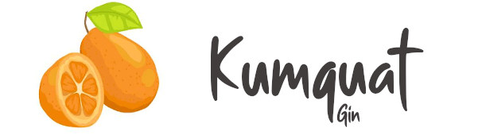

* **[Kumquat Gin](#intro)**
* **[Installation](#installation)**
* **[Patches](#patches)**
* **[Credits](#credits)**

# <a name="intro"></a>Kumquat Gin

Kumquat Gin is an administration theme based on [Gin](https://drupal.org/project/gin)
that includes some quality improvements for Kumquat based projects.

## <a name="installation"></a>Installation

- `composer require happyculture/kumquat_gin`
- Use directly or extend with your own admin theme.

## <a name="patches"></a>Patches

This theme works best with these patches:

```json
{
    "patches": {
        "drupal/paragraphs_ee": {
            "[#3344306] Use CSS class instead of opacity for add-in-between buttons": "https://www.drupal.org/files/issues/2023-02-24/3344306-5-2.0.x.patch"
        },
        "drupal/paragraphs_features": {
            "[#3159792] Add paragraphs behaviors action button": "https://patch-diff.githubusercontent.com/raw/thunder/paragraphs_features/pull/60.diff",
            "[#3344296] Clone remove button instead of creating a new one from scratch": "https://www.drupal.org/files/issues/2023-02-24/3344296-4-1.x.patch",
            "[#3345478] New feature: drag and drop arrows": "https://www.drupal.org/files/issues/2023-03-02/3345478-on-top-of-3159792.patch",
            "[#3353704] Add-in only works if active theme is claro or gin": "https://git.drupalcode.org/project/paragraphs_features/-/merge_requests/13.patch"
        }
    }
}
```

# <a name="credits"></a>Credits

The font used for the logo is [Smooth Butter from PutraCetol Studio](https://putracetol.com/product/smooth-butter/).
